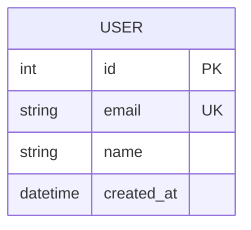

# {feature} - DB 설계

## 1. ERD (Entity Relationship Diagram)



## 2. 테이블 스키마

### 2.1 {테이블명}

| 컬럼 | 타입 | 제약조건 | 기본값 | 설명 |
|------|------|---------|--------|------|
| id | INT / UUID | PK, AUTO_INCREMENT | | |
| | | | | |
| created_at | TIMESTAMP | NOT NULL | CURRENT_TIMESTAMP | |
| updated_at | TIMESTAMP | NOT NULL | CURRENT_TIMESTAMP | |

### 인덱스

| 인덱스명 | 컬럼 | 유형 | 용도 |
|---------|------|------|------|
| | | UNIQUE / INDEX | |

## 3. 관계 정의

| 부모 테이블 | 자식 테이블 | 관계 | FK 컬럼 | ON DELETE |
|------------|------------|------|---------|-----------|
| | | 1:N / N:M | | CASCADE / SET NULL |

## 4. 마이그레이션

```sql
-- Migration: create_{table_name}
-- Created: {date}

CREATE TABLE IF NOT EXISTS {table_name} (
    id SERIAL PRIMARY KEY,
    created_at TIMESTAMP DEFAULT CURRENT_TIMESTAMP,
    updated_at TIMESTAMP DEFAULT CURRENT_TIMESTAMP
);
```

## 5. 시드 데이터

```sql
-- Seed: {table_name} 초기 데이터
INSERT INTO {table_name} (column1, column2) VALUES
    ('value1', 'value2');
```

## 6. 성능 고려사항

| 항목 | 전략 | 비고 |
|------|------|------|
| 인덱싱 | | 자주 조회되는 컬럼 |
| 파티셔닝 | | 대용량 테이블 시 |
| 캐싱 | | Redis 등 |
| 쿼리 최적화 | | N+1 방지 |

---

## 변경 이력

| version | date | change |
|---------|------|--------|
| v1.0 | | 초기 작성 |

<!-- template version: v0.8.1 -->
