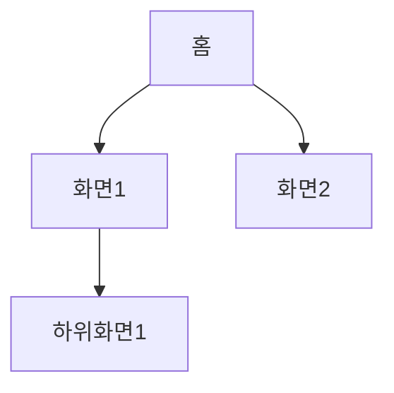
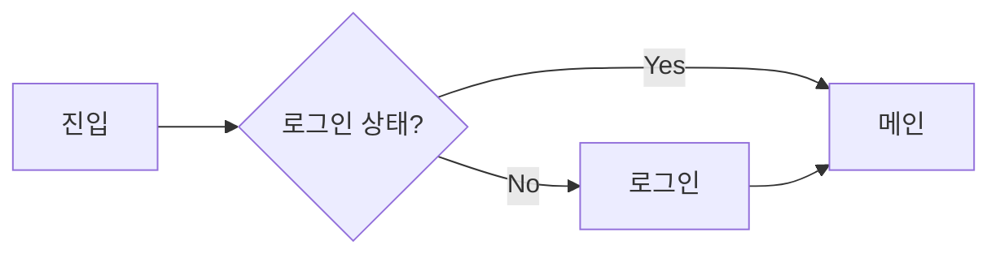

# {feature} - Information Architecture

## 1. 사이트맵

## 2. 네비게이션 구조

### 2.1 GNB (Global Navigation)
| 메뉴 | 경로 | 권한 | 비고 |
|------|------|------|------|
| | | | |

### 2.2 LNB (Local Navigation)
| 상위 메뉴 | 하위 메뉴 | 경로 |
|-----------|----------|------|
| | | |

## 3. 화면 흐름도 (User Flow)

## 4. 화면 목록

> 각 화면의 상세 정의(레이아웃, 컴포넌트, 인터랙션)는 설계 문서(`docs/05-design/`)의 "화면별 상세 정의"에서 통합 관리합니다.

| # | 화면 ID | 화면명 | 유형 | URL 패턴 | 설명 |
|---|---------|--------|------|----------|------|
| 1 | | | page/modal/drawer | | |
| 2 | | | | | |

## 5. 데이터 흐름 (전체)

| 화면 | 입력 데이터 | 출력 데이터 | API 호출 |
|------|------------|------------|----------|
| | | | |

## 6. 상태 관리 포인트

| 상태 | 범위 | 변경 시점 | 영향 화면 |
|------|------|----------|----------|
| | global/local | | |

---

## 변경 이력

| version | date | change |
|---------|------|--------|
| v1.0 | | 초기 작성 |

<!-- template version: v0.8.1 -->
